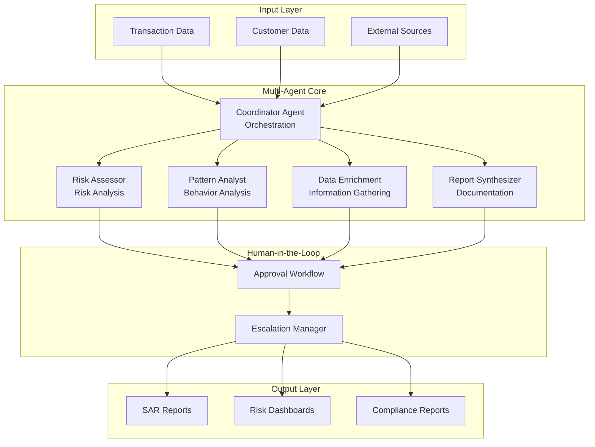

# 📁 **Project Organization & Architecture**

## 🏗️ **Multi-Agent AML System Architecture**

### **System Overview**
This is a comprehensive **Multi-Agent Anti-Money Laundering (AML) Investigation System** built with:
- **FastAPI** for RESTful APIs
- **LangGraph** for multi-agent orchestration
- **PostgreSQL/SQLite** for data storage
- **LangSmith** for prompt management
- **Vector Database** for document processing

## 🤖 **Agent Architecture Details**

### **Core Agents & Their Roles**

#### **1. Coordinator Agent** (`coordinator.py`)
- **Primary Role**: Workflow orchestration and decision routing
- **Capabilities**:
  - Investigation planning and management
  - Agent task assignment and coordination
  - Workflow state management
  - Human-in-the-loop approval coordination
  - Escalation management for critical cases
- **Input**: Transaction data, investigation context, user requirements
- **Output**: Investigation plan, agent assignments, workflow decisions
- **LangSmith Integration**: Prompt versioning and A/B testing

#### **2. Risk Assessor Agent** (`risk_assessor.py`)
- **Primary Role**: Risk classification and scoring
- **Capabilities**:
  - Risk level determination (Low/Medium/High/Critical)
  - Confidence scoring (0.0-1.0 scale)
  - Rule-based analysis integration
  - Risk factor evaluation and weighting
  - Regulatory compliance assessment
- **Input**: Transaction details, rule-based hints, customer profiles
- **Output**: Risk assessment with confidence score and reasoning
- **Prompt**: `risk_assessment.yaml`

#### **3. Pattern Analyst Agent** (`pattern_analyst.py`)
- **Primary Role**: Behavioral pattern detection and analysis
- **Capabilities**:
  - Transaction pattern analysis
  - Anomaly detection and flagging
  - Behavioral profiling and scoring
  - Suspicious activity identification
  - Temporal pattern analysis
- **Input**: Transaction history, behavioral data, customer patterns
- **Output**: Pattern analysis results, suspicious indicators, behavioral insights
- **Prompt**: `behavior_analysis.yaml`

#### **4. Data Enrichment Agent** (`data_enrichment.py`)
- **Primary Role**: External data collection and verification
- **Capabilities**:
  - KYC document verification and processing
  - External intelligence gathering
  - Customer profile enrichment
  - Sanctions list checking and screening
  - Third-party data integration
- **Input**: Customer data, transaction context, investigation requirements
- **Output**: Enriched customer profiles, external intelligence, verification results
- **Prompt**: `document_analysis.yaml`

#### **5. Report Synthesizer Agent** (`report_synthesizer.py`)
- **Primary Role**: Documentation and report generation
- **Capabilities**:
  - SAR (Suspicious Activity Report) generation
  - Compliance report creation
  - Evidence compilation and organization
  - Regulatory documentation
  - Executive summary generation
- **Input**: Investigation results, evidence, agent findings
- **Output**: Compliance reports, SAR documents, executive summaries
- **Prompt**: `sar_generation.yaml`, `edd_report.yaml`

### **Agent Communication Flow**



## 📁 **Detailed Project Structure**

### **Core Application (`app/`)**

#### **Agents Directory (`app/agents/`)**
```
agents/
├── aml_workflow.py          # Main LangGraph workflow orchestration
├── coordinator.py           # Coordinator agent implementation
├── risk_assessor.py         # Risk assessment agent
├── pattern_analyst.py       # Pattern analysis agent
├── data_enrichment.py       # Data enrichment agent
├── report_synthesizer.py    # Report generation agent
├── simple_workflow.py       # Simplified workflow for testing
├── simple_agents.py         # Simplified agent implementations
└── tools/                   # Agent tools and utilities
    ├── analysis_tools.py    # Analysis utilities
    ├── hitl_tools.py       # Human-in-the-loop tools
    ├── hitl_tools_simple.py # Simplified HITL tools
    ├── rule_engine.py      # Rule-based scoring engine
    ├── search_tools.py     # Search capabilities
    ├── sql_tools.py        # Database query tools
    └── vector_tools.py     # Vector database tools
```

#### **API Routes (`app/api/routes/`)**
```
routes/
├── agents.py               # Agent management endpoints
├── investigations.py        # Investigation workflow endpoints
├── transactions.py          # Transaction CRUD API
├── prompts.py              # Prompt management API (LangSmith)
├── rag.py                  # RAG (Retrieval-Augmented Generation) endpoints
├── monitoring.py           # System monitoring endpoints
└── health.py               # Health check endpoints
```

#### **Core Configuration (`app/core/`)**
```
core/
├── config_simple.py        # Application settings and configuration
├── logger.py               # Logging configuration
├── prompt_manager.py       # Prompt management system
├── langsmith_client.py     # LangSmith integration client
├── tracing.py              # Tracing and monitoring
└── database.py             # Database configuration
```

#### **Data Models (`app/models/`)**
```
models/
├── aml_models.py           # AML-specific data models
├── simple_case_models.py   # Simplified models for testing
└── base_models.py          # Base model classes
```

#### **Services (`app/services/`)**
```
services/
├── postgres_transaction_service.py  # PostgreSQL transaction service
├── sqlite_transaction_service.py    # SQLite transaction service
├── vector_service.py                # Vector database service
├── enrichment_service.py            # Data enrichment service
└── reporting_service.py             # Report generation service
```

### **Prompt Management (`prompts/`)**

#### **Agent Prompts**
```
prompts/
├── risk_assessment.yaml     # Risk assessment prompts
├── behavior_analysis.yaml  # Behavior analysis prompts
├── document_analysis.yaml  # Document analysis prompts
├── edd_report.yaml         # Enhanced Due Diligence prompts
└── sar_generation.yaml     # SAR generation prompts
```

#### **Prompt Structure**
Each prompt file contains:
- **Metadata**: Name, description, version, category
- **Prompt Template**: The actual prompt with variables
- **Variables**: Input parameters and their descriptions
- **Expected Output**: Output format and schema
- **Examples**: Sample inputs and outputs

### **Data Storage (`data/`)**

#### **Database Files**
```
data/
├── transactions.csv         # Main transaction dataset (1.3M+ records)
├── transactions.db          # SQLite database
├── aml_database.db          # AML-specific database
├── kyc_documents/          # KYC document storage
├── kyc_vectordb/           # Vector database for documents
└── processed/              # Processed data files
```

### **Notebooks (`notebooks/`)**

#### **Development & Testing Notebooks**
```
notebooks/
├── 01_database_setup.ipynb      # Database initialization
├── 02_document_chunking.ipynb   # Document processing
├── 03_agent_testing.ipynb       # Agent testing and validation
├── 04_api_testing.ipynb         # API endpoint testing
├── 05_aml_investigation_demo.ipynb # Complete workflow demo
├── 06_langgraph_workflow_testing.ipynb # LangGraph testing
└── data/                        # Notebook-specific data
```

### **Scripts (`scripts/`)**

#### **Utility Scripts**
```
scripts/
├── deploy_prompts.py         # Prompt deployment to LangSmith
├── generate_synthetic_data.py # Synthetic data generation
├── init_database.py          # Database initialization
├── load_aml_data.py         # AML data loading
├── load_financial_data.py   # Financial data loading
└── test_postgres_connection.py # Database connection testing
```

## 🔧 **API Endpoints Documentation**

### **Transaction Management API**

#### **Health & Statistics**
```bash
GET    /api/transactions/health          # Database health check
GET    /api/transactions/stats           # Transaction statistics
```

#### **CRUD Operations**
```bash
GET    /api/transactions/                # Get transactions (with filtering)
GET    /api/transactions/{id}           # Get specific transaction
POST   /api/transactions/               # Insert single transaction
POST   /api/transactions/bulk           # Bulk insert (up to 10K records)
DELETE /api/transactions/{id}           # Delete transaction
```

#### **Advanced Queries**
```bash
GET    /api/transactions/fraud/list     # Get fraud transactions
GET    /api/transactions/high-value/list # Get high-value transactions
GET    /api/transactions/search/amount  # Search by amount range
GET    /api/transactions/export/csv    # Export to CSV
```

### **Agent Management API**

#### **Agent Operations**
```bash
GET    /api/agents/                     # List all agents
GET    /api/agents/{agent_name}        # Get agent details
POST   /api/agents/{agent_name}/invoke # Invoke specific agent
GET    /api/agents/{agent_name}/status # Get agent status
```

### **Investigation Workflows API**

#### **Investigation Management**
```bash
POST   /api/investigations/start        # Start new investigation
GET    /api/investigations/{id}         # Get investigation status
POST   /api/investigations/{id}/approve # Human approval workflow
GET    /api/investigations/{id}/report  # Get investigation report
```

### **Prompt Management API (LangSmith Integration)**

#### **Prompt Operations**
```bash
GET    /api/prompts/                           # List all prompts
GET    /api/prompts/{agent_name}               # Get agent prompts
POST   /api/prompts/deploy                     # Deploy prompt to LangSmith
PUT    /api/prompts/{agent_name}               # Update agent prompt
GET    /api/prompts/{agent_name}/versions      # Get prompt versions
POST   /api/prompts/compare                     # Compare prompt versions
GET    /api/prompts/{agent_name}/performance   # Get performance metrics
```

## 🚀 **LangSmith Integration**

### **Prompt Management Features**

#### **Version Control**
- **Prompt Versioning**: Track changes over time
- **Rollback Capability**: Revert to previous versions
- **Change History**: Complete audit trail
- **Collaboration**: Team-based prompt management

#### **A/B Testing**
- **Performance Comparison**: Compare prompt effectiveness
- **Metrics Tracking**: Usage and performance analytics
- **Automated Testing**: Continuous evaluation
- **Result Analysis**: Statistical significance testing

#### **Deployment Management**
- **Automated Deployment**: Deploy to production
- **Environment Management**: Dev/staging/production
- **Rollback Safety**: Safe deployment practices
- **Monitoring**: Real-time performance tracking

### **LangSmith API Integration**

#### **Available Endpoints**
```bash
# Prompt Management
GET    /api/prompts/                           # List all prompts
GET    /api/prompts/{agent_name}               # Get agent prompts
POST   /api/prompts/deploy                     # Deploy to LangSmith
PUT    /api/prompts/{agent_name}               # Update agent prompt
GET    /api/prompts/{agent_name}/versions      # Get prompt versions
POST   /api/prompts/compare                    # Compare versions
GET    /api/prompts/{agent_name}/performance   # Performance metrics
```

#### **Prompt Categories**
1. **Risk Assessment**: Transaction risk classification
2. **Behavior Analysis**: Pattern detection and analysis
3. **Document Analysis**: KYC document processing
4. **EDD Reports**: Enhanced Due Diligence documentation
5. **SAR Generation**: Suspicious Activity Report creation

## 🗄️ **Database Architecture**

### **PostgreSQL (Production)**
- **Primary Table**: `csv_transactions`
- **Record Count**: 546,327 transactions
- **Features**: Full-text search, indexing, ACID compliance
- **Integration**: Supabase cloud database
- **Performance**: Sub-second query response times

### **SQLite (Development)**
- **Primary Table**: `transactions`
- **Use Case**: Local development and testing
- **Features**: Lightweight, embedded database
- **Performance**: Fast local queries

### **Vector Database**
- **Technology**: ChromaDB
- **Purpose**: KYC document embeddings
- **Features**: Semantic search, similarity matching
- **Use Case**: Document retrieval and analysis

## 🧪 **Testing & Quality Assurance**

### **Test Coverage**
- **API Testing**: All endpoints tested and validated
- **Agent Testing**: Workflow validation and performance
- **Database Testing**: Data integrity and performance
- **Integration Testing**: End-to-end workflow validation

### **Quality Metrics**
- **100% API Endpoint Coverage**: All endpoints tested
- **Comprehensive Error Handling**: Robust error management
- **Performance Benchmarking**: Response time optimization
- **Security Validation**: Input validation and security

## 📊 **Performance Metrics**

### **Database Performance**
- **546,327 transactions** loaded and accessible
- **Sub-second query response** times
- **Concurrent user support** with async operations
- **Bulk operations** (up to 10,000 records per request)

### **Agent Performance**
- **Real-time risk assessment** (< 2 seconds)
- **Pattern analysis** with behavioral insights
- **Automated report generation**
- **Human-in-the-loop** approval workflows

## 🔒 **Security & Compliance**

### **Data Security**
- **Encrypted connections** (PostgreSQL SSL)
- **Input validation** with Pydantic models
- **SQL injection protection** with parameterized queries
- **Access control** and authentication ready

### **Compliance Features**
- **SAR generation** for regulatory reporting
- **Audit trails** for all investigations
- **Risk scoring** based on regulatory guidelines
- **Document retention** and management

## 🎯 **Use Cases & Applications**

### **1. Transaction Monitoring**
- Real-time transaction analysis
- Automated risk scoring
- Suspicious activity detection
- Compliance reporting

### **2. Customer Due Diligence**
- KYC document processing
- Customer risk profiling
- Enhanced due diligence
- Ongoing monitoring

### **3. Regulatory Compliance**
- SAR generation and filing
- Regulatory reporting
- Audit trail maintenance
- Compliance documentation

### **4. Investigation Management**
- Case management workflows
- Evidence collection
- Report generation
- Human approval processes

---

## 📞 **Support & Documentation**

- **API Documentation**: `http://localhost:8000/docs`
- **Interactive Testing**: Built-in API explorer
- **Comprehensive Examples**: Jupyter notebooks
- **Developer Guide**: Detailed setup instructions

**🎉 Your Multi-Agent AML Investigation System is fully organized and ready for production use!**
